### 1. Главная страница
#### 1.1 Оплата товара
При вводе никнейма нужно выбрать товар из данного списка

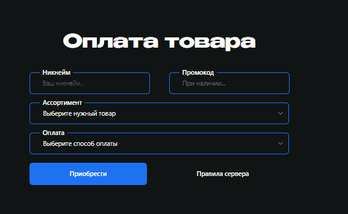

Добавить систему промокодов (только администрация может генерировать промокоды)

Добавить эти способы оплаты

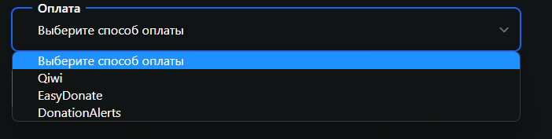

### 2. Статистика

Должна выглядить подобной диаграммой коннект к базе данных сервера, подсчет наигранных часов у игроков, поиск по никнейму

При нажатии на иконку игрока переход в его профиль.

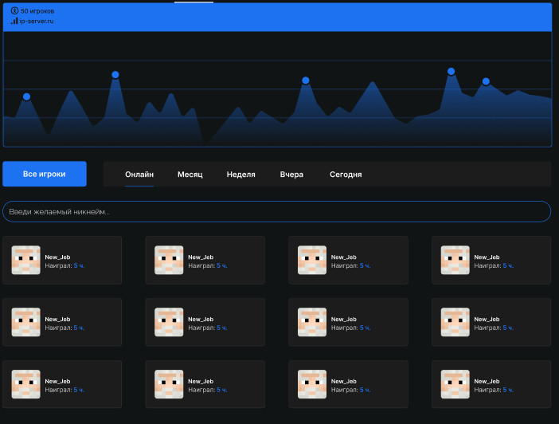
### 3. Города

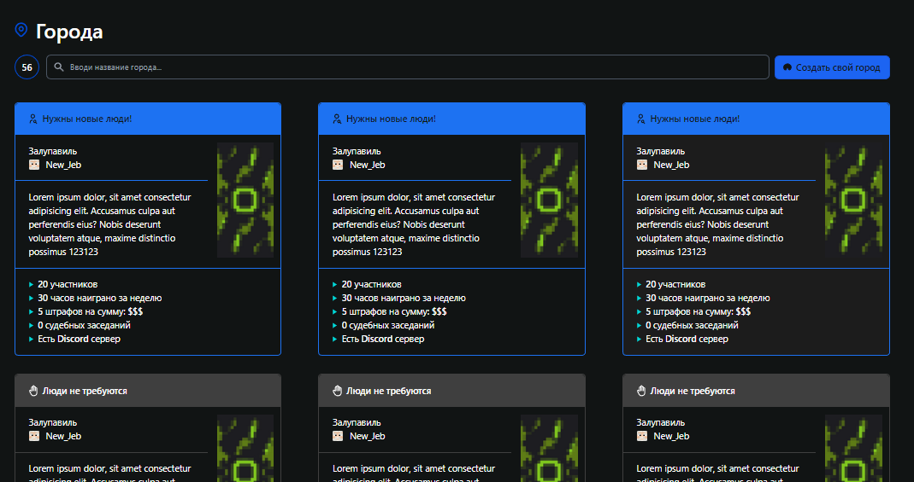

После нажатия на окошка с информацией о городе должен быть переход на старницу города

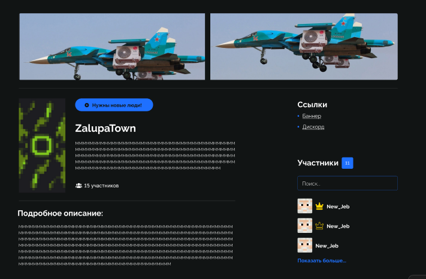

Поиск города по его названию/количество городов слева

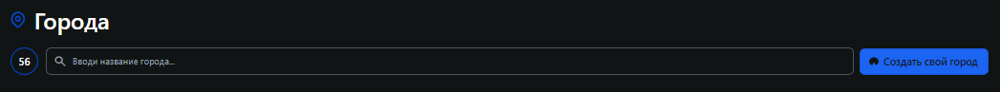

#### Настройка для владельца города 

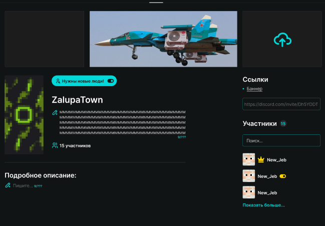

Загрузка своих баннеров, назначение жителя города замом мэра (корона без закраски)
Подробное описание, включение и выключение опции "Нужны новые люди", подсчет количества участников города.

### Профиль игрока

Привязка к вконтакте работа статистики только уже у игрока

Скин соединяется так же с базой данных на сервере

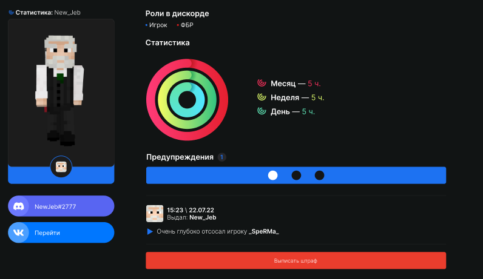

При нажатии кнопки выдать штраф у ФБР открывается подобная иконка 

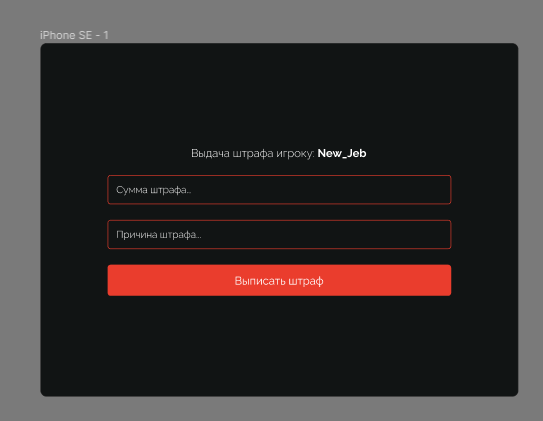

После чего должно произойти следующее действие во вкладке банка

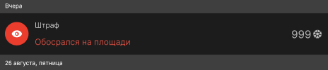

Предупреждения

Просто при его выдаче должно появиться это

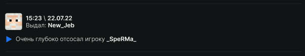

### Банк

1. Кнопка "Поделиться доступом" после ее нажатия можно поделиться доступом к карте или счету с другим игроком.

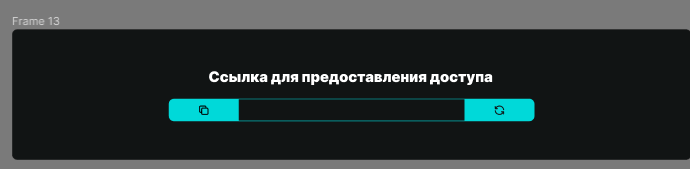

2. "Перевод по реквизитам" работает так нужно ввести номер карты игрока и нужную сумму после чего к нему на счет придут средства.

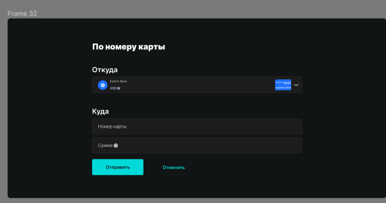

3. "Вклад" денежная сумма, которую клиент передает на хранение банку и получает от этого доход в виде начисленных процентов. Возможность редактирования процента.

4. "Кредиты" Банкир может выдать кредит на определенную сумму под определенный процент, списание должно происходить каждый месяц с момента получения кредита.

5. "Создать карту" кнопка доступная только банкирам позволяет создать карту игроку (генерирует карту с рандомными числами)

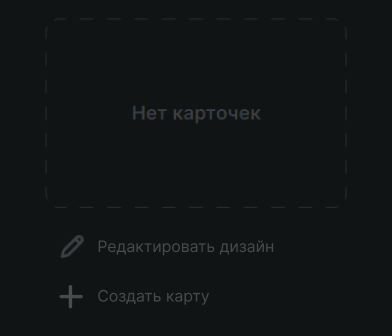

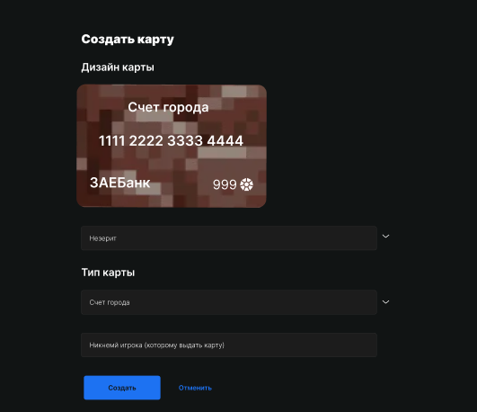

Тип карт всего два личный счет и счет города

6. "Редактирование дизайна" изменение дизайна карты на те которые есть в списке

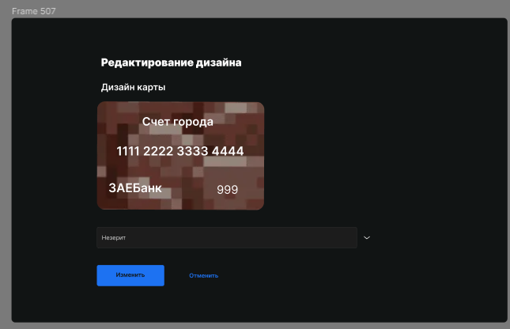

Все данные по проведенным операциям должна отображаться тут

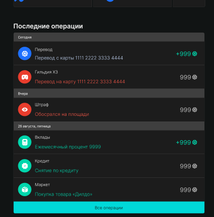

### Остальное

Выход из аккаунта

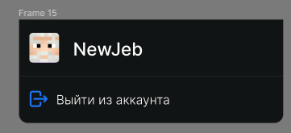

Уведомления должны работать примерно так, при выдаче предупреждения переход в свой профиль, при успешном переводе переход на страницу.

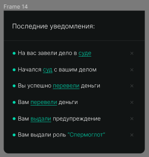

в случае если уведомлений нет то выглядит вот так

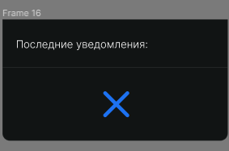